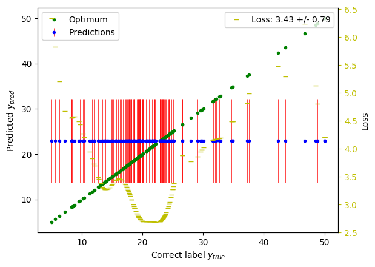

Introduction
************

Probabilistic forecasting makes predictions in settings where even perfect prior knowledge does not allow for impeccable forecast and provides appropriate measures of the uncertainty that is associated with them. In a supervised context, probabilistic prediction problems have been tackled through various strategies in both the frequentist and the Bayesian domain. Today, a variety of learning algorithms are available that make predictions in form of probability distributions. However, it is hard to compare different prediction strategies of the different toolboxes in a fair and transparent workflow.

``skpro`` is a supervised machine learning framework that allows for probabilistic forecasting within a unified interface with the goal to make model assessment and comparison fair, domain-agnostic and approachable. It is based on the well-known `scikit-learn`_ library and provides integrations for popular prediction toolboxes such as `PyMC3 <https://github.com/pymc-devs/pymc3>`_.

The package is being developed open source under the direction of `Dr Franz Király <https://www.ucl.ac.uk/statistics/people/franz-kiraly>`_ and has been released under a :doc:`BSD license <license>`.

Features
^^^^^^^^

The package offers a variety of features and specifically allows for

- a unified implementation and handling of supervised probabilistic prediction strategies
- strategy optimization through hyperparamter tuning and ensemble methods (e.g. bagging)
- comparison of frequentist and Bayesian prediction methods
- workflow automation

.. note::
    We are currently in public beta.

A motivating example
^^^^^^^^^^^^^^^^^^^^

Let's have a look at an example of Boston Housing price prediction (using sklearn's `boston data <http://scikit-learn.org/stable/modules/generated/sklearn.datasets.load_boston.html>`_).

.. literalinclude:: ../examples/simple.py
    :language: python
    :lines: 7-17

>>> Loss: 3.444260+-0.062277

If you are familiar with scikit-learn you will recognise that we define and train a model on the boston housing dataset and obtain the test prediction ``y_pred``. Furthermore, we use a loss function to calculate the loss between the predicted points and the true values -- nothing unexpected there.

Crucially, however, the skpro model does not just return a list of numbers or point predictions here. Instead, ``y_pred`` is a probabilistic prediction, i.e. it represents probability distributions for each individual data point.
We can, for instance, obtain the standard deviation of the predicted distribution that corresponds with the first (0th) test point (or any other test point distribution) ::

    >>> y_pred[0].std()
    8.79649064286

Notably, the interface represents all distributional properties, including the density function, that can be easily evaluated for arbitrary arguments ::

    >>> y_pred[0].pdf(x=42)
    0.00192808538756

Furthermore, it is possible to conveniently access the distributional properties in their vectorized form across the test sample::

    >>> y_pred.std().shape
    (152,)

The returned vector represent the standard deviations of each of the 152 predicted distributions that correspond to the 152 test points in the Boston data set. The prediction object also supports numpy's elementwise operations::

    >>> (numpy.mean(y_pred) * 2).shape
    (152,)

To get a better understanding of our example prediction we can plot the predicted distributions (mean in blue, standard deviation in red) versus the correct labels (in green):

You can see that the employed baseline model predicted a constant distribution for each data point (specifically, it used the mean and the standard deviation of the training labels); the losses of each prediction point vary accordingly.

The skpro predictions are hence forecasts of a genuine probabilistic kind that are a primary interest for many real-world applications. Notable, this can include Bayesian as well as frequentist models using the same unified and convenient interface.

Obviously, we ought to compare multiple models for gain meaningful insight into their performances. For this reason, skpro supports simplified and standardized prediction workflows for model assessment and comparison. The table below represents an example of a sorted result tables that can be easily generated by the workflow framework: Models are listed in the rows of the table while the columns present the cross-validated performance of a certain dataset and loss function. The numbers before the loss denote the model’s performance rank in the respective column. The models are sorted by the average model rank, displaying models with the best performances (that is the lowest losses) on top of the table.

+-----+-------------------+--------------------------------+--------------------------------+
| #   | Model             | CV(Dataset A, loss function)   | CV(Dataset B, loss function)   |
+=====+===================+================================+================================+
| 1   | Example model 1   | (2) 12\ :math:`\pm`\ 1\*       | (1) 3\ :math:`\pm`\ 2\*        |
+-----+-------------------+--------------------------------+--------------------------------+
| 2   | Example model 2   | (1) 5\ :math:`\pm`\ 0.5\*      | (2) 9\ :math:`\pm`\ 1\*        |
+-----+-------------------+--------------------------------+--------------------------------+
| 3   | Example model 3   | (3) 28\ :math:`\pm`\ 3\*       | (3) 29\ :math:`\pm`\ 4\*       |
+-----+-------------------+--------------------------------+--------------------------------+

Going back to the boston housing example, the code to produce such a model comparison can be composed in a few lines:

.. literalinclude:: ../examples/workflow.py
    :language: python
    :lines: 12-50

>>>
+-----+------------------------------------------------------+------------------------+
|   # | Model information                                    | CV(boston, log_loss)   |
+=====+======================================================+========================+
|   2 | Norm(point=LinearRegression(), std=Constant(std(y))) | (1) 4.25+/-0.29*       |
+-----+------------------------------------------------------+------------------------+
|   1 | DensityBaseline()                                    | (2) 4.28+/-0.18        |
+-----+------------------------------------------------------+------------------------+

The resulting table compares the composite prediction strategy against the baseline model and suggest that the model outperforms the baseline.

In sum, skpro thus allows for reliable, fair and best-practice model assessment with minimal development overhead for the user while being agnostic of the domain and vendor of your models.

Do you like what you see? Read the :doc:`installation instructions <installation>` or continue to the comprehensive :doc:`user guide <user_guide>` to learn more.

.. _scikit-learn: http://scikit-learn.org/
